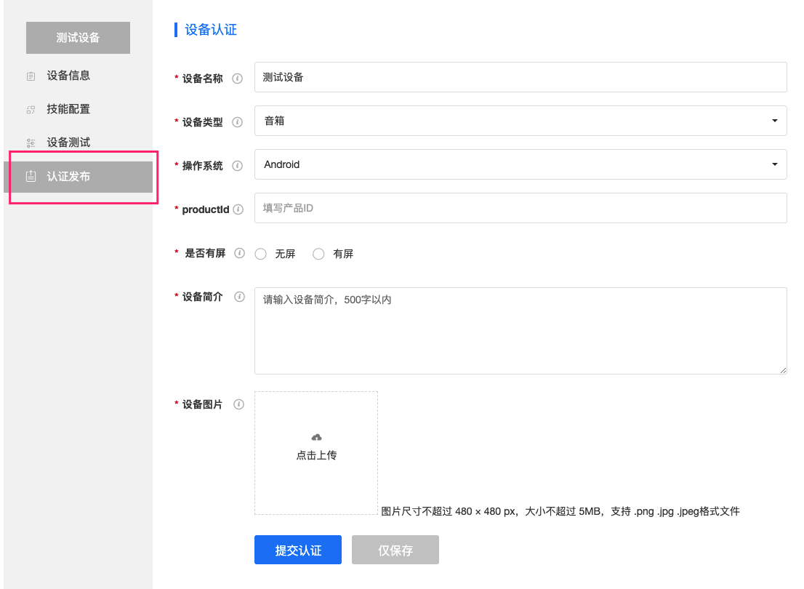

目录
=================

   * [设备接入入门文档](#设备接入入门文档)
      * [概述](#概述)
         * [设备中心能做什么？](#设备中心能做什么)
         * [为什么我要将我的真实设备接入Azero设备中心？](#为什么我要将我的真实设备接入azero设备中心)
      * [如何创建一个虚拟设备？](#如何创建一个虚拟设备)
      * [如何将真实设备与虚拟设备关联？](#如何将真实设备与虚拟设备关联)
      * [如何为设备添加技能？](#如何为设备添加技能)
      * [关于设备中心的Q&amp;A](#关于设备中心的qa)
         * [Q1：设备中心的debugger device有什么作用。](#q1设备中心的debugger-device有什么作用)
         * [Q2：设备中心的按钮"取消发布"、“升级”有什么作用。](#q2设备中心的按钮取消发布升级有什么作用)
         * [Q3：为什么要认证发布？](#q3为什么要认证发布)
         * [Q4：如何为已发布的设备更新技能配置？](#q4如何为已发布的设备更新技能配置)

# 设备接入入门文档

## 概述

### 设备中心能做什么？

倘若您的真实设备想接入Azero系统，您必须在设备中心为其创建一套与之对应的身份认证信息(clientId、productId)，即在网站为其创建一个虚拟设备。

设备中心是一个对这些虚拟设备，做管理、添加技能、模拟测试的服务平台。其中对已经发布的虚拟设备添加技能等同于对此虚拟设备对应的真实设备添加对应技能，且添加后会即可生效。

### 为什么我要将我的真实设备接入Azero设备中心？

将真实设备接入Azero设备中心，是为了让您的设备可以使用Azero系统的服务。

您将真实的设备接入设备中心，即等于您需要将Azero设备端SDK集成到您的设备中。

将Azero设备端SDK集成进您的设备，您的设备将扩充如下功能:

1，语音唤醒功能。

2，拾音降噪功能。

3，语音识别功能。

4，语义理解功能。

5，语音合成功能。

6，以及丰富的语音交互应用功能，即多元的技能服务。

## 如何创建一个虚拟设备？

创建一个虚拟设备的整体流程如下:

具体还可以参考:https://azero.soundai.com/docs/document 下的详细文档介绍。

## 如何将真实设备与虚拟设备关联？

真实设备与虚拟设备进行关联，主要通过两个关键值:clientId 与productId。如图:

这两个关键值需要被填入Azero端侧的SDK。这样Azero系统就能根据clientId 、productId为此产品提供对应的服务。

Ps：Client Secret目前暂时不会用到，无需关注。

具体两个关键值需要填写在什么地方。您可以根据设备的操作系统跳转对应的Azero端侧的SDK下载处，查看对应的README了解更多详情。

Azero Android SDK：https://github.com/sai-azero/Azero_SDK_for_Android

Azero Linux SDK：https://github.com/sai-azero/Azero_SDK_for_Linux

## 如何为设备添加技能？

为设备添加技能有两种方式:

1. 在对应设备的技能配置处添加,如图:

2.在技能商店选择技能为对应设备添加，如图:

**注意:** 虚拟设备未发布时，为其添加技能，能在此设备的模拟测试栏中，验证添加之后的效果。

若想为虚拟设备添加技能后，真实设备拥有同样的技能服务。有个2前提:

1. 此虚拟设备已经发布上线。
2. 真实设备中的Azero SDK集成了此虚拟设备的clientId、productId。

## 关于设备中心的Q&A

### Q1：设备中心的debugger device有什么作用。

**Answer**：这个设备用于技能中心的模拟测试。技能中心的模拟测试后台的响应机器人(bot)是同一个机器人(bot)，对应的就是这个debugger device。正常情况下，您不需要对此设备进行操作，若误操作的话，可能会导致技能中心模拟测试异常的现象。

### Q2：设备中心的按钮"取消发布"、“升级”有什么作用。

**Answer** : 取消发布:只有您的设备发布后，才会显示此按钮。当您决定下线此设备时，您可以点击此按钮停用此虚拟设备对应的真实设备的Azero整体服务。您后续还可以重新发布，重新启用该设备的Azero整体服务。

升级:若您的设备基础信息需要更改，可以点击此升级按钮，升级不需要后台审核。会立即生效。若您只是想更新设备配置的技能，不用点击此升级按钮。

### Q3：为什么要认证发布？

**Answer**：认证发布是激活您的虚拟设备的含义，只有当认证发布成功后的虚拟设备，此虚拟设备对应的clientId、与productId才是有效id，能被真实设备引用。若真实设备引用的是未发布设备的clientId、与productId。那么此真实设备在Azero系统中的合法性认证将不会被通过。就不可以享受Azero提供的基础功能服务。

### Q4：如何为已发布的设备更新技能配置？

**Answer**：您可以查看对应设备，点击技能配置。在技能配置中找到您需要修改的对应技能。您可以添加此技能到您的设备，也可以为您的设备移除该技能。添加与移除操作会立即生效。无需做其他任何操作。如添加技能提示如下信息，技能即添加成功。

